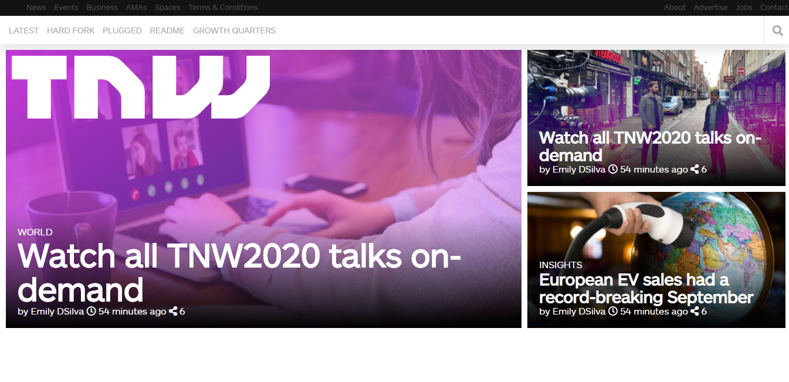

# Smash Magazine Heatmap

> "The Next Web" website clone



In this project we can see a responsive design clone of the UI of "The Next Web", responsive included

## Built With

- HTML
- CSS

## Live Demo

[Live Demo Link](https://elberthcorniell.github.io/tnw-clone/)


## Getting Started


To get a local copy up and running follow these simple example steps.

### Prerequisites

- Live Server plugin for Visual Studio Code 

### Setup

1- Clone the repository
```
git clone https://github.com/elberthcorniell/tnw-clone.git
```

2- Open the folder on VS Code, right click the index.html file and click on "Open With Live Server"

3- Everything should be running by now. 


## Author

👤 **Elbert Corniell**

- GitHub: [@elberthcorniell](https://github.com/elberthcorniell)
- Twitter: [@elberthcorniell](https://twitter.com/elberthcorniell)
- LinkedIn: [LinkedIn](https://www.linkedin.com/in/elbert-corniell-989183159/)


## 🤝 Contributing

Contributions, issues, and feature requests are welcome!

Feel free to check the [issues page](https://github.com/elberthcorniell/tnw-clone/issues).

## Show your support

Give a ⭐️ if you like this project!


## 📝 License

This project is [MIT](./LICENSE) licensed.
